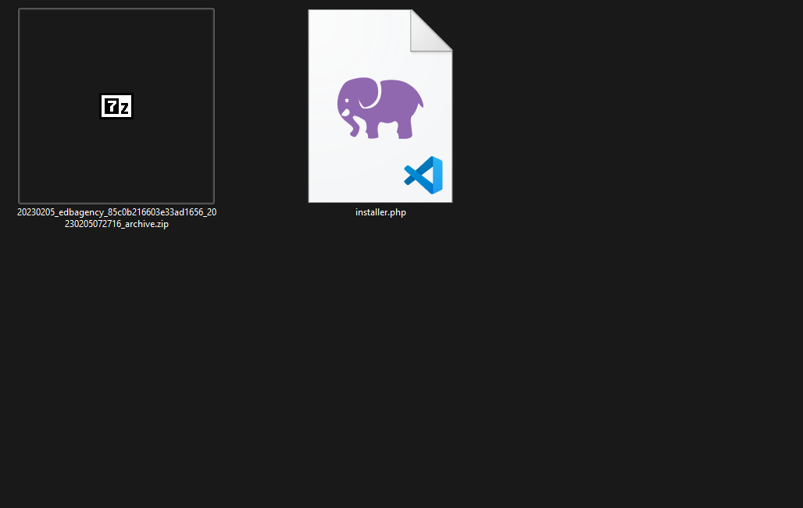
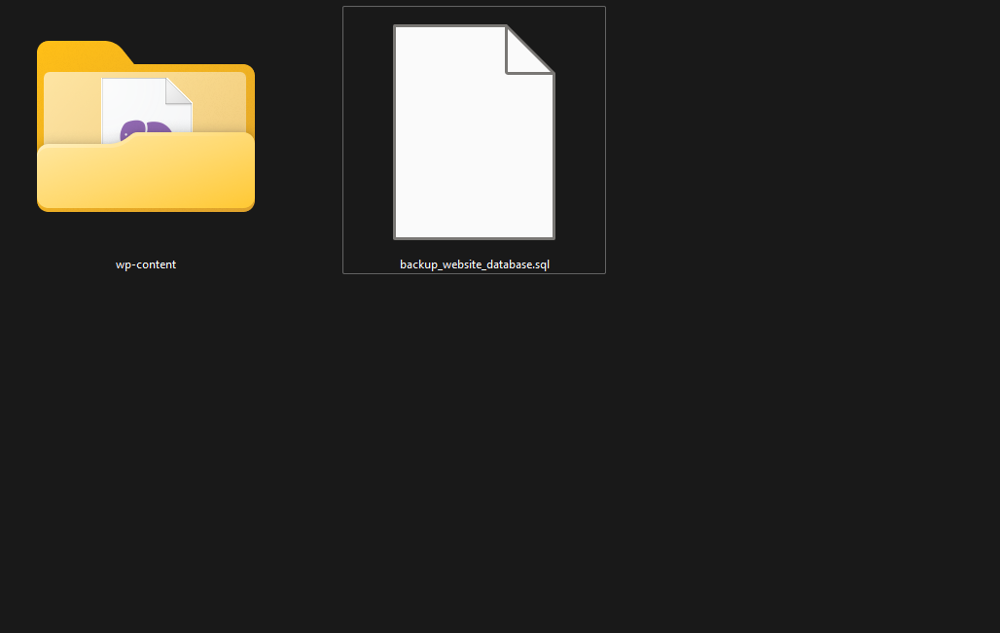
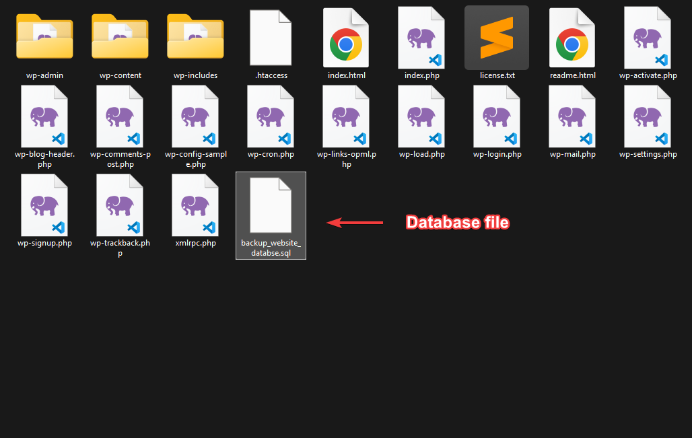

# Công Cụ Tự Động Hóa WordPress cho Laragon

Một công cụ tự động hóa mạnh mẽ được viết bằng Python để quản lý việc cài đặt và khôi phục WordPress trong môi trường Laragon. Công cụ này giúp đơn giản hóa quy trình thiết lập các trang WordPress mới và khôi phục các trang đã có, làm cho nó trở nên lý tưởng cho các nhà phát triển và quản trị viên làm việc với nhiều cài đặt WordPress.

## Tính Năng

-   **Cài Đặt WordPress Mới**

    -   Tự động cài đặt WordPress core
    -   Thiết lập thông tin quản trị tùy chỉnh
    -   Quản lý plugin và theme
    -   Cấu hình ngôn ngữ
    -   Hỗ trợ SSL
    -   Tạo và cấu hình cơ sở dữ liệu
    -   Tối ưu hóa các tùy chọn WordPress

-   **Khôi Phục từng Website hoặc hàng loạt bằng file .CSV**
    -   Hỗ trợ nhiều phương thức khôi phục:
        -   All-in-One WP Migration (`ai1`)
        -   Duplicator (`dup`)
        -   WP-Content (`wpcontent`)
        -   WordPress Core (`wp`)
    -   Xử lý hàng loạt bằng file CSV
    -   Báo cáo khôi phục chi tiết
    -   Tự động xử lý lỗi

## Yêu Cầu Hệ Thống

-   Hệ điều hành Windows
-   Đã cài đặt [Laragon](https://laragon.org/download/)
-   Python 3.x
-   MySQL/MariaDB (đã được tích hợp với Laragon)
-   WP-CLI (sẽ được sử dụng thông qua Laragon)

## Cài Đặt

1. Clone repository này về máy tính của bạn

    ```bash
    git clone url https://github.com/Hungnth/laragon-auto-script
    ```

2. Chỉnh sửa file `resource.json` với cấu hình plugin và theme của bạn
3. Chỉnh sửa file `config.py` hoặc có thể để mặc định
4. Đảm bảo đã cài đặt Python >= 10, ở đây không dùng bất cứ thư viện nào bên ngoài
5. Cài đặt WP-CLI cho Laragon, tham khảo [Link](https://gist.github.com/ladislavsulc/8b7450fa7cddd0129e0dcfbbbc5a6647)

    - Hãy đảm bảo thay thế `C:\laragon` bằng đường dẫn cài đặt Laragon trên máy tính của bạn

    ```bash
     cd C:\laragon\usr\bin && curl -L -O https://raw.github.com/wp-cli/builds/gh-pages/phar/wp-cli.phar &&  echo @ECHO OFF > wp.bat && echo php "%~dp0wp-cli.phar" %* >> wp.bat
    ```

## Cách Sử Dụng

### Cài Đặt WordPress Mới

#### Cách 1: Nhập từng yêu cầu theo yêu cầu hiển thị trên màn hình console

```bash
main.py
```

#### Cách 2: Dùng argument, có 3 trường bắt buộc là website_name, admin_username, admin_password

```bash
main.py website1 admin admin
```

**Hoặc dùng đầy đủ arguments:**

```bash
main.py -n website1 -u admin -p admin
```

**Các tùy chọn cài đặt**

-   `-s`: Cài đặt SSL cho website
-   `-i` Cài đặt plugin, chỉnh sửa ở file `resource.json`, sau đó chọn plugin cần cài đặt theo số thứ tự
-   `-o`: Không cài đặt các option cho Wordpress, cài đặt sẽ nhanh hơn, bạn có thể chỉnh sửa file `config.py`

### Khôi phục từng Website;

-   `--ai1`: Dùng plugin All in One Migration WP (Unlimited nếu file lớn), thay bằng đường dẫn file `.wpress` của bạn

    ```bash
      main.py website1 admin admin --ai1 "D:\backup_website_ai1.wpress"
    ```

-   `--dup`: Dùng plugin Duplicator, thay bằng đường dẫn thư mục chưa cả 2 file `.zip` và file `installer.php`, **yêu cầu đủ cả 2 file**

    ```bash
      main.py website1 admin admin --dup "D:\backup_website_duplicator_folder"
    ```

    <details>
    <summary>Hình ảnh ví dụ thư mục chứa file backup</summary>

    

    </details>

-   `--wpcontent`, `-db`: Restore thủ công bằng cách dùng thư mục `wp-content` và file `.sql`, bắt buộc phải có đường dẫn thư mục `wp-content` và file database `.sql`

    ```bash
      main.py website1 admin admin --wpcontent "D:\backup_website_wpcontent_folder" --db "D:\backup_website_wpcontent_file.sql"
    ```

    <details>
    <summary>Hình ảnh ví dụ thư mục chứa file backup</summary>

    

    </details>

-   `--wp`:Restore thủ công bằng cách source code đầy đủ, bắt buộc phải có đường dẫn thư mục source code và bên trong có duy nhất 1 file `.sql`

    ```bash
      main.py website1 admin admin --wp "D:\backup_website_wp_folder"
    ```

    <details>
        <summary>Hình ảnh ví dụ thư mục chứa file backup</summary>

    

    </details>

### Khôi Phục Hàng Loạt Website

1. Tạo file CSV với các cột bắt buộc sau, tham khảo file `bulk_restore.csv`, hoặc bạn có thể chỉ định đường dẫn cho file .CSV nhưng hãy đảm bảo điền đầy đủ các trường bắt buộc
    - `website_name`: Tên website
    - `restore_method`: Một trong các phương thức: `ai1`, `dup`, `wpcontent`, `wp`
    - `source_path`: Đường dẫn đến file/thư mục backup
    - `db_path`: Nếu dùng `wpcontent` thì trường này là bắt buộc

Các cột tùy chọn:

-   `admin_username`: Tên đăng nhập quản trị WordPress
-   `admin_password`: Mật khẩu quản trị
-   `admin_email`: Email quản trị
-   `ssl`: Bật SSL (true/false)
-   `db_path`: Đường dẫn file database (bắt buộc cho phương thức `wpcontent`)

1. Chạy khôi phục hàng loạt:

    ```bash
    main.py --bulk_restore
    ```

2. Chạy khôi phục hàng loạt bằng file .csv khác **(Tùy chọn)**:
    ```bash
    main.py --bulk_restore "D:\backup\optional.csv"
    ```
    **Định dạng file .csv tham khảo file `bulk_restore.csv`**

## Các Phương Thức Khôi Phục

1. **ai1** (All-in-One WP Migration)

    - Yêu cầu file backup được tạo bởi plugin All-in-One WP Migration
    - Xử lý khôi phục hoàn chỉnh bao gồm cả cơ sở dữ liệu

2. **dup** (Duplicator)

    - Yêu cầu backup được tạo bởi plugin Duplicator
    - Khôi phục cả files và cơ sở dữ liệu

3. **wpcontent** (WP-Content)

    - Yêu cầu thư mục wp-content và file cơ sở dữ liệu riêng
    - Hữu ích cho các backup thủ công

4. **wp** (WordPress Core)
    - Cài đặt WordPress mới với khôi phục nội dung
    - Yêu cầu backup files WordPress

## Kết Quả Đầu Ra

-   Kết quả khôi phục được xuất ra file CSV có tên `bulk_restore_results_[timestamp].csv`
-   Log chi tiết về các khôi phục thành công và thất bại
-   Báo cáo tổng kết hiển thị tổng số, số thành công và số thất bại

## Lưu Ý

-   Công cụ tự động xử lý việc tạo cơ sở dữ liệu
-   Chứng chỉ SSL được quản lý thông qua Laragon
-   Cấu hình WordPress được tối ưu hóa cho hiệu suất
-   Hỗ trợ file CSV mã hóa UTF-8 và UTF-16
-   Tự động khởi động lại Apache sau khi thực hiện các thao tác

## Xử Lý Lỗi

Công cụ cung cấp thông báo lỗi chi tiết cho các vấn đề phổ biến:

-   Website/cơ sở dữ liệu đã tồn tại
-   File nguồn bị thiếu hoặc không hợp lệ
-   Lỗi kết nối cơ sở dữ liệu
-   Vấn đề về quyền truy cập
-   Phương thức khôi phục không hợp lệ

## Bảo Mật

-   Thông tin đăng nhập được lưu trữ an toàn
-   Cấu hình SSL được tự động hóa
-   Các thao tác với cơ sở dữ liệu được xử lý an toàn
-   Thông tin nhạy cảm được xử lý cẩn thận

## Đóng Góp

Hãy thoải mái gửi các vấn đề và yêu cầu cải tiến!

## Changelog;

### Version: 1.0.0

-   Tạo script
